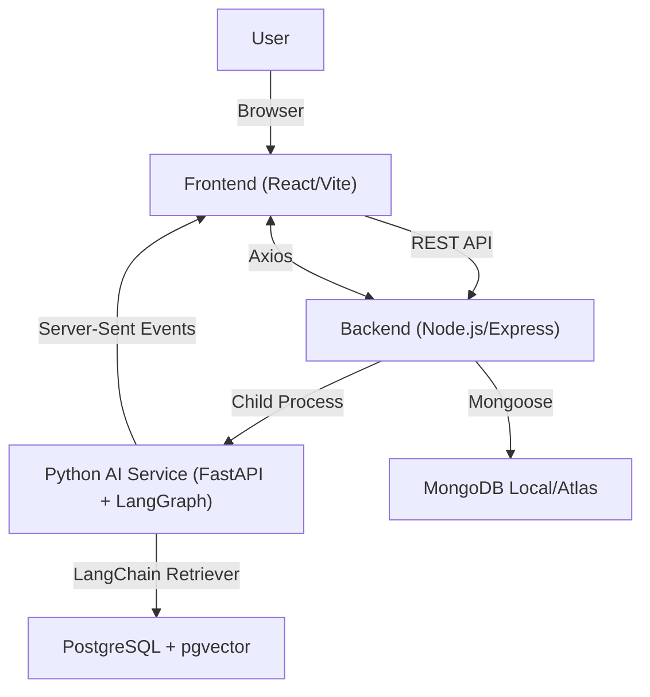

# Company Researcher WebApp

A full-stack web application for researching, tracking, and managing companies aligned with your career and business interests. Built with React, Node.js/Express, MongoDB, PostgreSQL/pgvector, and a Python-based RAG/AI service.

---

## Features

- User authentication (email/password, JWT)
- Company notes dashboard: create, edit, and manage notes
- Resume builder: generate and download professional resumes
- AI-powered resume matching: a Retrieval-Augmented Generation pipeline that matches resumes against company job requirements using LangChain retrieval chains, LangGraph orchestration, and pgvector semantic search
- Real-time AI streaming: resume evaluation results stream to the frontend via Server-Sent Events instead of a blocking response
- Responsive UI with Tailwind CSS
- Account management: avatar upload, password change, and settings
- Settings and help pages
- Dark/light mode
- Fast, optimized performance

---

## Tech Stack

**Frontend:**
- React 19 (Vite)
- Tailwind CSS
- React Router DOM
- Axios
- EventSource / Server-Sent Events for real-time streaming

**Backend:**
- Node.js, Express.js
- MongoDB (Mongoose) — users, notes, resume builder data
- PostgreSQL + pgvector — job posting embeddings and resume-evaluation history
- Python / FastAPI — RAG and AI orchestration service (`ai_agents.py`)
- LangChain — retrieval chains over the pgvector store
- LangGraph — multi-node agent pipeline (retrieve → rate → advise)
- sentence-transformers (all-MiniLM-L6-v2) — document embeddings
- CORS enabled

**DevOps:**
- GitHub for version control
- uv for Python dependency management

---

## Project Structure
webapp/
├── frontend/      # React app
│   └── src/
│       ├── components/
│       ├── pages/
│       └── ...
├── backend/       # Node.js/Express API & Python AI/RAG integration
│   ├── controllers/
│   ├── models/
│   ├── rag/
│   │   ├── documents/     # Job posting source documents
│   │   ├── ingest.py      # Chunk, embed, and store in pgvector
│   │   └── retrieve.py    # LangChain retriever over pgvector
│   ├── ai_agents.py        # FastAPI app, LangGraph pipeline, SSE endpoint
│   └── server.js
└── ...

---

## Architecture Diagram



---

## AI / RAG Pipeline Overview

The resume evaluation feature is powered by a real Retrieval-Augmented Generation pipeline, not a black-box search API:

1. **Ingestion** (`rag/ingest.py`): Job posting documents are chunked (roughly 400 characters, with 50-character overlap), embedded using `sentence-transformers` (`all-MiniLM-L6-v2`), and stored in PostgreSQL via the `pgvector` extension, with metadata (company name, source file) attached to each chunk.
2. **Retrieval** (`rag/retrieve.py`): Incoming queries are embedded with the same model and matched against stored vectors using a LangChain `VectorStoreRetriever` wrapping the pgvector store, returning the most relevant, source-attributed chunks.
3. **Orchestration** (`ai_agents.py`): A LangGraph pipeline chains three nodes — retrieve, rate, and advise — to generate a company-specific fit rating and improvement suggestions from the retrieved context.
4. **Streaming**: Results are streamed to the frontend in real time via a Server-Sent Events endpoint, so users see feedback appear incrementally instead of waiting for the full response.

---

## Local Setup & Installation

### 1. Clone the repository
```sh
git clone <your-repo-url>
cd webapp
```

### 2. Install dependencies
```sh
cd backend && npm install && uv sync
cd ../frontend && npm install
```

If you still have an old `backend/venv/` from the pip workflow, remove it manually after confirming uv works:

```sh
rm -rf backend/venv
```

### 3. Set up PostgreSQL and pgvector
```sh
brew install postgresql@16
brew install pgvector
```
Then, inside `psql`:
```sql
CREATE DATABASE company_research;
\c company_research
CREATE EXTENSION vector;
```

### 4. Environment variables
- Never commit `.env` files to git.
- Add `.env` to `.gitignore` (already done).
- Set environment variables on your deployment platform (Render, Vercel, etc).

#### Example `backend/.env`:
PORT=5000
MONGODB_URI=mongodb+srv://<user>:<pass>@cluster.mongodb.net/<dbname>
JWT_SECRET=your_jwt_secret
POSTGRES_URI=postgresql://<user>:<pass>@localhost:5432/company_research
PERPLEXITY_API_KEY=your_perplexity_api_key

#### Example `frontend/.env`:
VITE_API_URL=https://your-backend.onrender.com

### 5. Ingest job postings
Add job posting `.txt` files to `backend/rag/documents/`, then run:
```sh
cd backend
uv run python rag/ingest.py
```

### 6. Run locally

#### Backend (Node/Express)
```sh
cd backend
npm start
```

#### Python AI/RAG service (FastAPI)
```sh
cd backend
uv run uvicorn ai_agents:app --reload --port 8000
```

#### Frontend
```sh
cd frontend
npm run dev
```

- Frontend: http://localhost:5173
- Backend: http://localhost:5000
- AI/RAG service: http://localhost:8000

---

## Cloud Deployment Guide

### Frontend (Vercel)
1. Go to Vercel and sign up.
2. Import your GitHub repo.
3. Set the project root to `frontend/`.
4. Build command: `npm run build`
5. Output directory: `dist`
6. Add environment variables (e.g., `VITE_API_URL`).
7. Click Deploy to get your public URL.

### Backend (Render)
1. Go to Render and sign up.
2. Create a new Web Service.
3. Set the root to `backend/`.
4. Build command: `npm install && uv sync`
5. Start command: `node server.js`
6. Add environment variables (e.g., `MONGODB_URI`, `JWT_SECRET`, `POSTGRES_URI`, `PERPLEXITY_API_KEY`).
7. Click Create Web Service to get your backend URL.

### AI/RAG service (Render or similar)
1. Deploy `backend/ai_agents.py` as a separate Web Service (or the same one, exposing both).
2. Start command: `uv run uvicorn ai_agents:app --host 0.0.0.0 --port $PORT`
3. Add environment variables (`POSTGRES_URI`, `PERPLEXITY_API_KEY`).
4. Make sure the Postgres instance used here has the `pgvector` extension enabled.

---

## Environment Variable Security
- `.env` files are git-ignored and must never be committed.
- Use your deployment platform's dashboard to set secrets.
- If secrets are ever exposed, rotate them immediately.

---

## Usage Guide

1. Register or log in to access your dashboard.
2. Dashboard: add, edit, and manage company notes.
3. AI insights: get company research and RAG-based resume-fit evaluations, streamed in real time.
4. Resume builder: build and download your resume.
5. Account: upload an avatar, change your password, manage settings.
6. Settings/help: customize your experience and get support.

---

## Troubleshooting

- **MongoDB connection error**: make sure your `MONGODB_URI` is correct and points to MongoDB Atlas, not localhost.
- **Postgres/pgvector errors**: confirm the `vector` extension is enabled (`CREATE EXTENSION vector;`) and `POSTGRES_URI` is correct.
- **No retrieval results**: confirm `rag/ingest.py` has been run and `backend/rag/documents/` contains real job posting text, not empty or placeholder files.
- **CORS issues**: the backend must allow requests from your frontend domain.
- **Build fails on deploy**: check logs for missing dependencies or misconfigurations.
- **Environment variables not working**: double-check spelling and redeploy after changes.

---

## Contributing

1. Fork the repo.
2. Create a new branch (`git checkout -b feature/your-feature`).
3. Commit your changes (`git commit -am 'Add new feature'`).
4. Push to the branch (`git push origin feature/your-feature`).
5. Open a pull request.

---

## FAQ

**Can I use a local MongoDB for production?**
No — use MongoDB Atlas or another cloud provider for production deployments.

**Can I use a local Postgres instance for production?**
No — use a managed Postgres provider with pgvector support (e.g. Render, Supabase, Neon) for production deployments.

**How do I add new AI features or job postings?**
Add new `.txt` files to `backend/rag/documents/`, re-run `rag/ingest.py`, and extend `backend/ai_agents.py` to expose new endpoints in `server.js`.

**How do I secure my API?**
Use HTTPS, strong JWT secrets, and never expose secrets in the frontend.

**Can I deploy both frontend and backend on the same platform?**
Yes, but separating them (Vercel and Render) is recommended for scalability.

---

## License
ISC